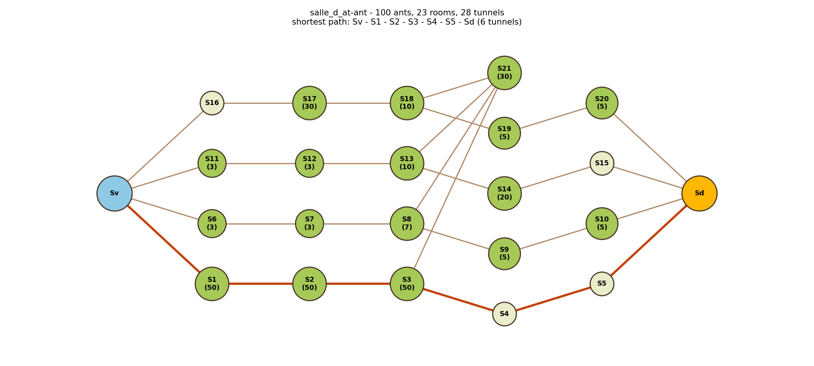
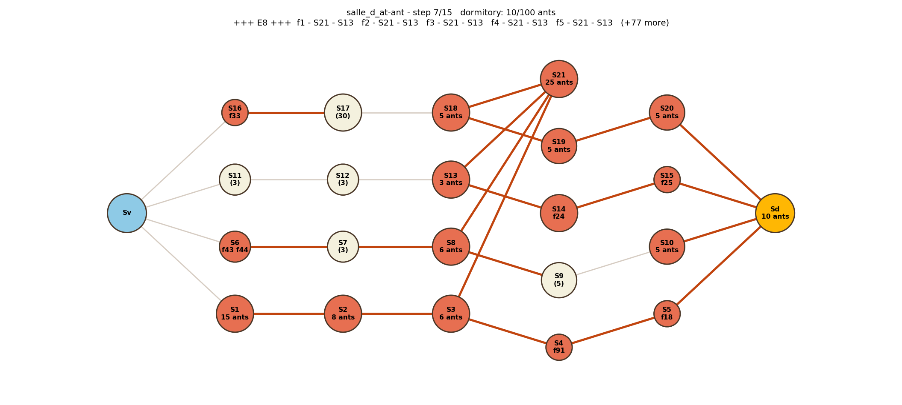
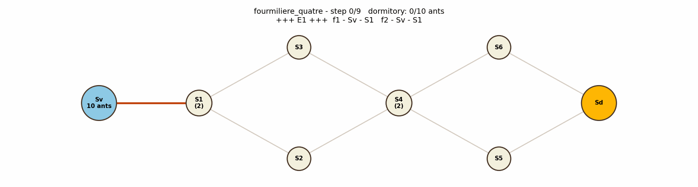

# Une vie de fourmi

Move a whole colony of ants from the vestibule of an anthill to its dormitory,
**in as few steps as possible**.



---

## The problem

An anthill is a set of **rooms** connected by **tunnels**. Two rooms are special:
the **vestibule** `Sv`, where the colony gathers at nightfall, and the **dormitory**
`Sd`, where every ant must end up. The colony counts `F` ants and the field is full
of predators, so the ants want to be in bed as fast as possible.

The rules make it a lot less obvious than "everybody follow the shortest path":

- every ant walks at the same speed, and a tunnel is crossed instantly;
- a room holds **one ant at a time**, unless the file says otherwise (`S2 { 4 }`);
- an ant may enter a room only if that room is free, or if the ant occupying it
  leaves during the same step (the dormitory and the vestibule have no limit);
- during one step, every ant either waits where it is, or walks into an adjacent room;
- the whole colony must reach the dormitory in a **minimum number of steps**.

So the shortest path is only part of the answer: a corridor of small rooms is a
bottleneck, and the colony has to spread over several routes and pipeline itself
to avoid traffic jams.

### Anthill files

The nine anthills live in [`fourmilieres/`](fourmilieres/):

```
f=5             number of ants in the colony
S1              a room holding one ant
S2 { 4 }        a room holding four ants at the same time
Sv - S1         a tunnel between the vestibule and room 1
```

### Expected output

```
+++ E1 +++
f1 - Sv - S1
f2 - Sv - S2
+++ E2 +++
f1 - S1 - Sd
f2 - S2 - Sd
f3 - Sv - S1
+++ E3 +++
f3 - S1 - Sd
```

An ant that waits is not written down.

---

## In plain words

Picture a crowd leaving a concert through a building full of tiny corridors.
Everyone wants the exit, but most rooms fit a single person, so rushing all at
once would only create a jam. The ants do the opposite of rushing: they behave
like a **pipeline**. As soon as an ant steps out of a room, the ant right behind
moves in: the whole line advances at once, every second, without anybody ever
waiting in front of a full room. And instead of queuing on the shortest route,
the colony **splits across every route that leads to the dormitory**, each one
carrying as many ants per second as its narrowest room allows. The time the
colony needs is therefore not the length of the shortest path, but the time the
widest set of parallel routes needs to drain a hundred ants, and the program finds
exactly how to share the ants between those routes so that the last one to go to
bed goes to bed as early as possible.

---

## How it works

### 1. The anthill as a graph

[`ants.py`](ants.py) reads the file into an `Anthill`: a dictionary of `Room`
objects (name + capacity) and a list of tunnels. `Anthill.graph()` turns it into an
undirected [NetworkX](https://networkx.org/) graph (rooms are nodes carrying their
capacity, tunnels are edges), and `Anthill.draw()` renders it.

Rooms are laid out in columns: **the column of a room is its distance to the
vestibule**, so the drawing reads from the entrance on the left to the dormitory
on the right. Tunnels that fly over other rooms are drawn curved, otherwise they
would be hidden exactly behind them.

### 2. Finding the fewest steps

The naive approach, searching every possible position of every ant, explodes
immediately (100 ants over 23 rooms). The trick is that **ants are
interchangeable**: what matters is how many ants are in a room, not which ones.
Counting interchangeable items flowing through a network with limited capacities
is exactly a **maximum flow** problem.

The anthill is therefore unfolded in time (a *time expanded network*):

- every room is copied once per step, and split into an `in` node and an `out`
  node. The edge between them carries the **capacity of the room**, which encodes
  the rule "an ant may enter only if there is room for it once everybody has moved";
- an edge `out(room, t) -> in(room, t+1)` means *waiting*;
- an edge `out(a, t) -> in(b, t+1)` means *crossing the tunnel a-b*;
- a source feeds `in(Sv, 0)` with `F` ants, and `out(Sd, T)` empties into a sink.

The maximum flow of that network is the **maximum number of ants that can be in
bed after `T` steps**. Waiting longer never hurts, so feasibility is monotonic in
`T`: a **binary search** between the length of the shortest path (a lower bound)
and `shortest path + F - 1` (the worst case, ants queuing one behind another)
finds the smallest `T` for which all `F` ants arrive. That `T` is optimal: no
schedule can do better, because any schedule *is* a flow in that network.

Two refinements keep the result readable:

- among the schedules of that same optimal length, a **minimum cost flow** picks
  the one where the ants wait the least (waiting anywhere but in the dormitory
  costs one unit), so nobody dawdles for no reason;
- edges walking back into the vestibule or out of the dormitory are dropped: such
  a move can only replace plain waiting, so removing them keeps the optimum.

### 3. From flow to ants

The flow is then **decomposed into unit paths**, one per ant, which gives each ant
its trajectory. Two ants swapping rooms during the same step are untangled (since
ants are interchangeable, exchanging what they do next lets both stay put), and the
ants are numbered `f1, f2, …` in the order they leave the vestibule. Comparing two
consecutive positions gives the moves of each step, printed as `f1 - Sv - S1`.

### 4. Checking the rules

`Solution.errors()` re-reads the produced trajectories and checks, independently
from the solver, that every ant starts in the vestibule, ends in the dormitory,
only moves through real tunnels, and that no room ever holds more ants than it
can. **All nine anthills come back clean.**

### 5. Step by step pictures

`Solution.draw_steps()` renders the state of the anthill at each step: rooms
holding ants in orange with the ants inside, tunnels used by the upcoming step
highlighted, and the moves of the step written in the title. The frames are
assembled into a GIF.





---

## Results

| Anthill | Ants | Rooms | Tunnels | Shortest path | Steps | Solved in |
| --- | ---: | ---: | ---: | ---: | ---: | ---: |
| `fourmiliere_zero` | 2 | 4 | 4 | 2 | **2** | 0.01 s |
| `fourmiliere_un` | 5 | 4 | 3 | 3 | **7** | 0.01 s |
| `fourmiliere_deux` | 5 | 4 | 4 | 1 | **1** | 0.01 s |
| `fourmiliere_trois` | 5 | 6 | 5 | 3 | **7** | 0.01 s |
| `fourmiliere_quatre` | 10 | 8 | 9 | 5 | **9** | 0.02 s |
| `fourmiliere_cinq` | 50 | 16 | 20 | 5 | **11** | 0.19 s |
| `fourmiliere_3D` | 50 | 11 | 15 | 4 | **14** | 0.30 s |
| `La_hormiguera_de_la_muerte` | 30 | 12 | 46 | 4 | **9** | 0.12 s |
| `salle_d_at-ant` | 100 | 23 | 28 | 6 | **15** | 0.58 s |

A few readings:

- `fourmiliere_deux` has a `Sd - Sv` tunnel: the dormitory is next door and the
  five ants are in bed in **one** step;
- `fourmiliere_un` is a corridor of single rooms: the first ant needs 3 steps and
  the pipeline then delivers one ant per step, hence `3 + (5 - 1) = 7`;
- `La_hormiguera_de_la_muerte` looks frightening with its 46 tunnels, but
  everything must squeeze through `S9 - S10 - Sd`, five ants at a time: 9 steps;
- `salle_d_at-ant` sends its 100 ants down four parallel corridors, using room
  `S21` (30 places) as a staging area to feed the corridors that still have room.

---

## Conclusion

The instinctive answer, "send everyone down the shortest path", is wrong as soon
as rooms have a capacity: what limits the colony is not distance, it is the
**throughput** of the routes. Realising that ants are interchangeable is what turns
an intractable puzzle (all the possible positions of 100 ants) into a classic
problem solved in a few tenths of a second: a maximum flow over the anthill
unfolded in time, wrapped in a binary search on the number of steps.

The result is **provably optimal**, not merely good: any valid schedule is a flow
in that network, so if no flow carries the colony in `T - 1` steps, no colony can
do it either. The independent rule checker confirms every trajectory, and the nine
anthills, from 2 to 100 ants, are all solved and drawn in under a minute.

What we would explore next: tunnels with their own capacity (currently only rooms
limit traffic), and anthills where ants have different destinations, which would
turn the single flow into a multi-commodity one, which is a much harder problem.

---

# Une vie de fourmi (version française)

Amener toute une colonie de fourmis du vestibule de la fourmilière jusqu'au
dortoir, **en un minimum d'étapes**.


---

## La problématique

Une fourmilière est un ensemble de **salles** reliées par des **tunnels**. Deux
salles sont particulières : le **vestibule** `Sv`, où la colonie se rassemble à la
tombée de la nuit, et le **dortoir** `Sd`, où toutes les fourmis doivent arriver.
La colonie compte `F` fourmis et le champ est plein de prédateurs : il faut être
au lit le plus vite possible.

Les règles rendent le problème bien moins évident que « tout le monde suit le plus
court chemin » :

- toutes les fourmis se déplacent à la même vitesse, et un tunnel se traverse
  instantanément ;
- une salle n'accueille **qu'une seule fourmi à la fois**, sauf mention contraire
  dans le fichier (`S2 { 4 }`) ;
- une fourmi ne peut entrer dans une salle que si celle-ci est vide, ou si la
  fourmi qui l'occupe part pendant la même étape (le vestibule et le dortoir n'ont
  aucune limite) ;
- à chaque étape, chaque fourmi attend sur place ou passe dans une salle adjacente ;
- l'intégralité de la colonie doit rejoindre le dortoir en un **minimum d'étapes**.

Le plus court chemin n'est donc qu'une partie de la réponse : un couloir de petites
salles est un goulot d'étranglement, et la colonie doit se répartir sur plusieurs
routes et se mettre en file continue pour éviter les embouteillages.

### Fichiers de fourmilière

Les neuf fourmilières se trouvent dans [`fourmilieres/`](fourmilieres/) :

```
f=5             nombre de fourmis de la colonie
S1              une salle qui accueille une fourmi
S2 { 4 }        une salle qui accueille quatre fourmis en même temps
Sv - S1         un tunnel entre le vestibule et la salle 1
```

### Sortie attendue

```
+++ E1 +++
f1 - Sv - S1
f2 - Sv - S2
+++ E2 +++
f1 - S1 - Sd
f2 - S2 - Sd
f3 - Sv - S1
+++ E3 +++
f3 - S1 - Sd
```

Une fourmi qui attend n'est pas notée.

---

## Vulgarisation

Imaginez une foule qui quitte un concert par un bâtiment rempli de tout petits
couloirs. Tout le monde veut la sortie, mais la plupart des pièces ne tiennent
qu'une personne : se précipiter ne créerait qu'un bouchon. Les fourmis font
exactement l'inverse : elles fonctionnent comme une **chaîne**. Dès qu'une fourmi
quitte une salle, celle qui la suit y entre : toute la file avance d'un cran en
même temps, à chaque seconde, sans que personne ne patiente devant une salle
pleine. Et plutôt que de faire la queue sur le chemin le plus court, la colonie
**se répartit sur toutes les routes qui mènent au dortoir**, chacune transportant
autant de fourmis par seconde que le permet sa salle la plus étroite. Le temps
nécessaire à la colonie n'est donc pas la longueur du plus court chemin, mais le
temps que met le plus large faisceau de routes parallèles à écouler cent fourmis,
et le programme trouve exactement comment répartir les fourmis entre ces routes
pour que la dernière couchée le soit le plus tôt possible.

---

## Fonctionnement

### 1. La fourmilière en graphe

[`ants.py`](ants.py) lit le fichier dans un objet `Anthill` : un dictionnaire de
`Room` (nom + capacité) et une liste de tunnels. `Anthill.graph()` en fait un
graphe non orienté [NetworkX](https://networkx.org/) où les salles deviennent des
nœuds porteurs de leur capacité et les tunnels des arêtes, puis `Anthill.draw()`
le dessine.

Les salles sont disposées en colonnes : **la colonne d'une salle correspond à sa
distance au vestibule**, si bien que le dessin se lit de l'entrée à gauche vers le
dortoir à droite. Les tunnels qui survolent d'autres salles sont tracés en arc,
sans quoi ils passeraient pile derrière elles.

### 2. Trouver le minimum d'étapes

L'approche naïve, qui explore toutes les positions possibles de toutes les fourmis,
explose immédiatement (100 fourmis dans 23 salles). L'astuce, c'est que les
**fourmis sont interchangeables** : ce qui compte est le nombre de fourmis dans une
salle, pas lesquelles. Compter des objets interchangeables qui circulent dans un
réseau à capacités limitées, c'est exactement un problème de **flot maximum**.

La fourmilière est donc dépliée dans le temps (*réseau déplié dans le temps*) :

- chaque salle est copiée une fois par étape, et coupée en un nœud `in` et un nœud
  `out`. L'arête entre les deux porte la **capacité de la salle**, ce qui traduit
  la règle « une fourmi n'entre que s'il y a de la place une fois tout le monde
  déplacé » ;
- une arête `out(salle, t) -> in(salle, t+1)` signifie *attendre* ;
- une arête `out(a, t) -> in(b, t+1)` signifie *traverser le tunnel a-b* ;
- une source alimente `in(Sv, 0)` avec `F` fourmis, et `out(Sd, T)` se déverse dans
  un puits.

Le flot maximum de ce réseau donne le **nombre maximum de fourmis qui peuvent être
couchées après `T` étapes**. Comme attendre plus longtemps ne nuit jamais, la
faisabilité est croissante en `T` : une **recherche binaire** entre la longueur du
plus court chemin (borne inférieure) et `plus court chemin + F - 1` (le pire cas,
les fourmis à la queue leu leu) trouve le plus petit `T` pour lequel les `F`
fourmis arrivent. Ce `T` est optimal : aucun horaire ne peut faire mieux, puisque
tout horaire *est* un flot de ce réseau.

Deux raffinements rendent le résultat lisible :

- parmi les horaires de cette longueur optimale, un **flot de coût minimum** retient
  celui où les fourmis attendent le moins (attendre ailleurs que dans le dortoir
  coûte une unité), pour que personne ne traîne sans raison ;
- les arêtes qui reviennent dans le vestibule ou qui sortent du dortoir sont
  retirées : un tel déplacement ne peut que remplacer une simple attente, les
  supprimer préserve donc l'optimum.

### 3. Du flot aux fourmis

Le flot est ensuite **décomposé en chemins unitaires**, un par fourmi, ce qui donne
à chacune sa trajectoire. Deux fourmis qui échangeraient leur salle pendant la même
étape sont démêlées (les fourmis étant interchangeables, échanger leur suite laisse
les deux sur place), et les fourmis sont numérotées `f1, f2, …` dans l'ordre où
elles quittent le vestibule. La comparaison de deux positions consécutives donne
les déplacements de chaque étape, affichés sous la forme `f1 - Sv - S1`.

### 4. Vérification des règles

`Solution.errors()` relit les trajectoires produites et vérifie, indépendamment du
solveur, que chaque fourmi part du vestibule, arrive au dortoir, n'emprunte que de
vrais tunnels, et qu'aucune salle ne contient jamais plus de fourmis qu'elle ne
peut. **Les neuf fourmilières passent sans erreur.**

### 5. Images étape par étape

`Solution.draw_steps()` dessine l'état de la fourmilière à chaque étape : les
salles occupées en orange avec les fourmis qui s'y trouvent, les tunnels empruntés
par l'étape à venir en surbrillance, et les déplacements de l'étape écrits dans le
titre. Les images sont ensuite assemblées en GIF.


---

## Résultats

| Fourmilière | Fourmis | Salles | Tunnels | Plus court chemin | Étapes | Résolue en |
| --- | ---: | ---: | ---: | ---: | ---: | ---: |
| `fourmiliere_zero` | 2 | 4 | 4 | 2 | **2** | 0,01 s |
| `fourmiliere_un` | 5 | 4 | 3 | 3 | **7** | 0,01 s |
| `fourmiliere_deux` | 5 | 4 | 4 | 1 | **1** | 0,01 s |
| `fourmiliere_trois` | 5 | 6 | 5 | 3 | **7** | 0,01 s |
| `fourmiliere_quatre` | 10 | 8 | 9 | 5 | **9** | 0,02 s |
| `fourmiliere_cinq` | 50 | 16 | 20 | 5 | **11** | 0,19 s |
| `fourmiliere_3D` | 50 | 11 | 15 | 4 | **14** | 0,30 s |
| `La_hormiguera_de_la_muerte` | 30 | 12 | 46 | 4 | **9** | 0,12 s |
| `salle_d_at-ant` | 100 | 23 | 28 | 6 | **15** | 0,58 s |

Quelques lectures :

- `fourmiliere_deux` possède un tunnel `Sd - Sv` : le dortoir est à côté et les cinq
  fourmis sont couchées en **une** étape ;
- `fourmiliere_un` est un couloir de salles simples : la première fourmi met 3
  étapes, puis la file en livre une par étape, d'où `3 + (5 - 1) = 7` ;
- `La_hormiguera_de_la_muerte` impressionne avec ses 46 tunnels, mais tout doit
  passer par `S9 - S10 - Sd`, cinq fourmis à la fois : 9 étapes ;
- `salle_d_at-ant` envoie ses 100 fourmis dans quatre couloirs parallèles, en se
  servant de la salle `S21` (30 places) comme zone d'attente pour alimenter les
  couloirs qui ont encore de la place.

---

## Conclusion

La réponse instinctive, « tout le monde par le plus court chemin », est fausse dès
que les salles ont une capacité : ce qui limite la colonie n'est pas la distance,
c'est le **débit** des routes. Comprendre que les fourmis sont interchangeables,
c'est ce qui transforme un casse-tête inabordable (toutes les positions possibles de
100 fourmis) en un problème classique résolu en quelques dixièmes de seconde : un
flot maximum sur la fourmilière dépliée dans le temps, encadré par une recherche
binaire sur le nombre d'étapes.

Le résultat est **prouvé optimal**, et pas seulement bon : tout horaire valide est un
flot de ce réseau, donc si aucun flot ne fait passer la colonie en `T - 1` étapes,
aucune colonie ne le peut non plus. Le vérificateur de règles indépendant valide
chaque trajectoire, et les neuf fourmilières, de 2 à 100 fourmis, sont toutes
résolues et dessinées en moins d'une minute.

Les pistes à explorer ensuite : des tunnels avec leur propre capacité (aujourd'hui
seules les salles limitent le trafic), et des fourmilières où les fourmis ont des
destinations différentes, ce qui transformerait le flot unique en flot
multi-produits, un problème nettement plus difficile.
